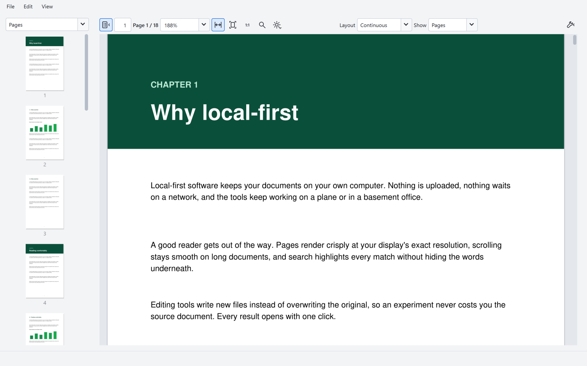
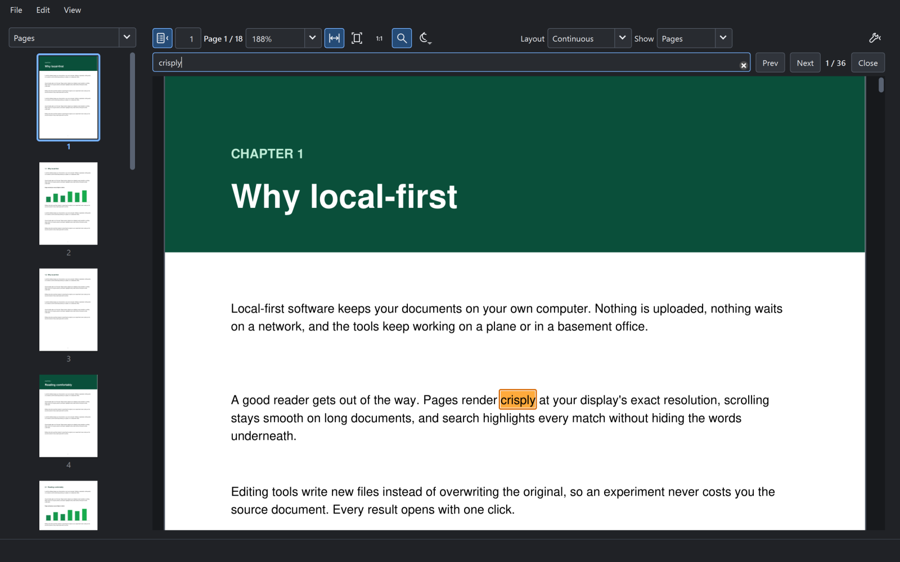
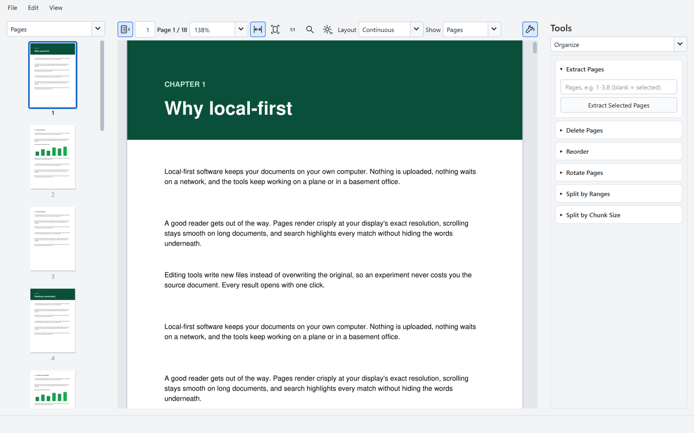
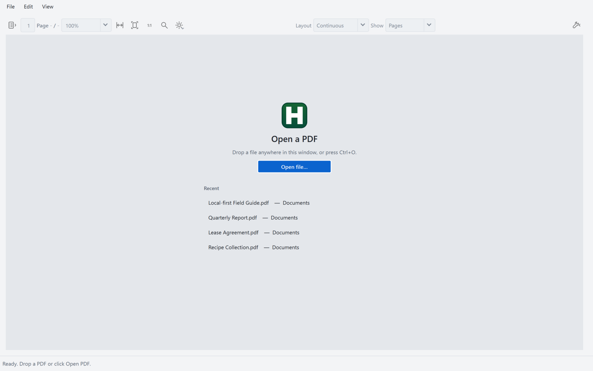

# HomePDF

HomePDF (shown as **HOME PDF** in the app) is a Windows desktop PDF reader and toolkit built with PySide6 and PyMuPDF. PDF reading and editing run locally on your computer.



| Find in document (dark theme) | Tools, one card at a time | Start screen |
| --- | --- | --- |
|  |  |  |

## Download and run

**Windows 10/11, 64-bit:** [Download HomePDF portable](https://github.com/the-unmindful/homepdf/releases/latest/download/HomePDF-portable.zip). See the [latest release](https://github.com/the-unmindful/homepdf/releases/latest) for its build details and checksum.

1. Download `HomePDF-portable.zip` using the link above or from the release's **Assets** list.
2. Extract the entire ZIP into a writable folder.
3. Run `PDFUltimate.exe`. Keep `_internal`, `scripts`, and `ocr_tool` beside the executable.
4. Open a PDF in the app, or drag a PDF onto the executable.

The reader requires no Python installation. The portable package includes the white H on deep green app icon and creates its HomePDF Start menu shortcut when first opened. Source package version is `0.2.0b3`. See the release page for the current build and checksum.

Windows may show an unsigned-app prompt. Settings and outputs normally live in `Documents\HOME PDF`. To keep them beside the executable, create an empty `portable.flag` file in the extracted folder; data will then use `HOME PDF_DATA`.

## Features

- Crisp rendering at your display's exact resolution, smooth continuous scrolling, and zoom that stays anchored under the cursor (Ctrl+wheel, touchpad pinch, Ctrl+= / Ctrl+-)
- Select and copy text directly on the page; search with legible highlights
- PDF tabs, fit width/page, thumbnails, outlines, plain-text view, printing (Ctrl+P), and automatic reload when the file changes on disk; open files are never locked
- Password-protected PDFs ask for their password when opened
- Right-click selected thumbnails to rotate, extract, or delete pages
- Merge, split, extract, delete, reorder, and rotate pages
- Watermarks, image stamps, compression, password protection, and unlock
- PDF export to DOCX, TXT, Markdown, HTML, JSON, RTF, PNG, and JPG. Document exports contain extracted text; PNG/JPG preserve page appearance.
- Create PDFs from text, Markdown, HTML, DOCX, images, and PDFs. DOCX and HTML import text only; layout and embedded images are not retained. RTF import is unsupported.
- Optional GLM OCR runner for text, tables, formulas, and structured extraction

## Run from source

Install **Python 3.11, 64-bit** on Windows, then run in PowerShell:

```powershell
git clone https://github.com/the-unmindful/homepdf.git
cd homepdf
py -3.11 -m venv .venv
.\.venv\Scripts\python.exe -m pip install -r .\desktop\requirements.txt
powershell -NoProfile -ExecutionPolicy Bypass -File .\scripts\run_dev.ps1
```

Source runs keep application data in the checkout's `runtime_data` folder. Only desktop dependencies are required for the reader and PDF toolkit.

## Build a portable package

With the local virtual environment created above:

```powershell
powershell -NoProfile -ExecutionPolicy Bypass -File .\scripts\build_portable.ps1
```

The script installs PyInstaller and desktop dependencies, then writes a dated ZIP and folder under `release`. It also refreshes `release\PDFUltimate-portable` and its ZIP. Use `-SkipInstall` only when those build dependencies are already installed. No installer is included in this release.

## Publish a release

Portable downloads belong in GitHub Releases; do not commit ZIP files to the repository. To publish a new Windows build, push a new version tag:

```powershell
git tag v0.1.3
git push origin v0.1.3
```

Use the next unused version number. The **Publish Windows portable release** workflow builds on Windows with Python 3.11, checks the packaged app, and publishes `HomePDF-portable.zip` and `SHA256SUMS.txt` as release assets. The main download link follows the latest release automatically. An existing tag or release is not overwritten.

## Optional OCR

OCR requires a separate project-local Python environment and an NVIDIA GPU with CUDA support. Python, CUDA PyTorch, and model weights are **not bundled** with the portable reader. Initial installation and model download require internet access; subsequent runs can use the local cache.

For a source checkout:

```powershell
powershell -NoProfile -ExecutionPolicy Bypass -File .\scripts\install_ocr_dependencies.ps1
powershell -NoProfile -ExecutionPolicy Bypass -File .\scripts\run_ocr.ps1 --help
```

In the app's OCR tab, point **OCR Command** to the checkout's `scripts\ocr.bat`. For a portable folder, create `.venv` there, install `ocr_tool\requirements.txt` plus the CUDA PyTorch versions specified in [the installation script](scripts/install_ocr_dependencies.ps1), and select that folder's `scripts\ocr.bat`.

See [the OCR guide](ocr_tool/README.md) for modes, page selection, and output formats.

## Add HomePDF to the Windows Start menu

Open `PDFUltimate.exe` once after extracting the ZIP. HomePDF automatically creates a current-user Start menu shortcut with the green H icon. No administrator access or terminal commands are required. Keep the extracted folder in its chosen location; if you move it, open the executable again to update the shortcut.

You can also double-click **Add HomePDF to Start.cmd** in the extracted folder. For a source checkout or a custom executable location, the PowerShell helper remains available:

```powershell
powershell -NoProfile -ExecutionPolicy Bypass -File .\scripts\create_start_menu_shortcut.ps1
```

Use `-DesktopShortcut` to also add a desktop shortcut. From a source checkout, the script targets `release\PDFUltimate-portable\PDFUltimate.exe` by default, or accepts `-ExePath`.

To regenerate the icon, run `scripts\make_icon.ps1` on Windows. The portable build embeds the icon in the executable and bundles it for the app window and taskbar.

## Choose HomePDF as your PDF reader

From a source checkout, register the extracted executable for the current Windows user:

```powershell
powershell -NoProfile -ExecutionPolicy Bypass -File .\scripts\register_portable_pdf_handler.ps1 -ExePath 'C:\Apps\HomePDF\PDFUltimate.exe'
```

Then open **Windows Settings > Apps > Default apps** and choose **HOME PDF** or `PDFUltimate.exe` for `.pdf`. To remove the registration, run `scripts\unregister_portable_pdf_handler.ps1`.

## Repository contents

- `desktop/`: reader, toolkit, UI, dependency pins, and app icon
- `scripts/`: source launcher, portable build, OCR launch/setup, and PDF registration
- `ocr_tool/`: optional OCR runner and example extraction schema
- `docs/`: published build metadata and checksum
- `downloads/`: pointers to the portable Windows release assets
- `.github/workflows/`: Windows build and release publication

Virtual environments, build outputs, personal documents, session data, and model caches are excluded from Git. The ready-to-run binary and its SHA-256 checksum are attached to the [latest release](https://github.com/the-unmindful/homepdf/releases/latest). A published release's build details and checksum are also recorded in [docs/latest-build.json](docs/latest-build.json) and [docs/SHA256SUMS.txt](docs/SHA256SUMS.txt).

## License

Project source is covered by the repository's [MIT license](LICENSE). Third-party dependencies retain their own licenses; see [dependency notices](THIRD_PARTY.md). The repository license does not replace licenses of libraries bundled in the portable download.

## Reader experience

Tools run in cancellable local processes, with progress and safe publication of complete results. Reading stays responsive during exports. Existing files are never silently replaced. Use Open result or Show folder after an operation.

The fresh layout gives reading most of the window. Pages and Outline share Navigation; Tools opens on demand. Fit Page works in both reader modes, and zoom keeps the current reading position. Ctrl+Tab / Ctrl+Shift+Tab switch documents; Ctrl+F finds text. Text preview is bounded to keep very large documents responsive; TXT export contains the full text.

OCR tuning lives under Advanced settings. Progress stays in the app, Run is disabled during a job, and Cancel stops the owned Windows process tree. Cancelling OCR may leave partial OCR output for inspection.
